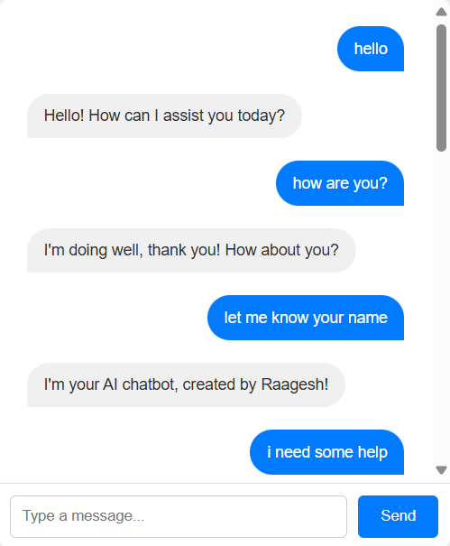
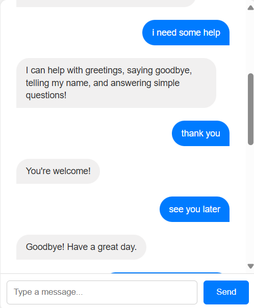
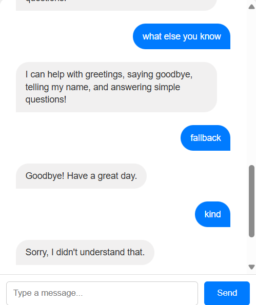

#  AI Chatbot Using JavaScript & Wit.ai

This is a simple AI-powered chatbot web application built using **HTML**, **CSS**, and **JavaScript**, integrated with **Wit.ai** (Natural Language Processing API). It can understand user intents and respond accordingly with a clean and responsive chat interface.

---

##  Project Objective

To develop a lightweight, front-end-only chatbot application that:
- Accepts user text input
- Detects the **intent** using Wit.ai
- Responds with appropriate replies
- Enhances the UI with chat bubbles and typing animation

---

##  Features

- Intent detection using Wit.ai  
- Clean UI with chat bubbles for user and bot  
- Typing indicator (`...`) before bot responds  
- Scrollable chat history 
- No backend required (pure front-end project)

---

##  Intents Handled

This chatbot understands the following intents (trained using Wit.ai):

| Intent        | Example Message           | Bot Response                        |
|---------------|---------------------------|--------------------------------------|
| `greet`       | "hi", "hello"             | "Hello! How can I assist you today?" |
| `how_are_you` | "how are you?"            | "I'm doing well, thank you!"         |
| `bye`         | "bye", "goodbye"          | "Goodbye! Have a great day."         |
| `help`        | "what can you do?"        | "I can help with greetings, etc."    |
| `name`        | "what's your name?"       | "I'm your AI chatbot, created by Raagesh!" |
| `thanks`      | "thanks", "thank you"     | "You're welcome!"                    |
| `fallback`    | (unrecognized intent)     | "Sorry, I didn't understand that."   |

---

##  Project Structure

├── index.html # Chatbot UI
├── style.css # Styling (chat layout, dark mode, chat bubbles)
└── script.js # Logic + Wit.ai integration

---

##  How to Run the Project

1. Clone or download this repository:
   ```bash
   git clone https://github.com/Raagesh-A02/ai-chatbot.git
2. Open index.html in any web browser.

3. Chat with the bot!


---


## Requirements

- Internet connection (for API calls to Wit.ai)

- A valid Wit.ai Server Access Token

-> Create an app

-> Train intents

-> Replace the token in script.js:  const WIT_TOKEN = "YOUR_ACCESS_TOKEN";

---

## **Screenshots**

> Below are screenshots of the project:








---


## Author

Raagesh A 
M.Tech. (Integrated) - Computer Science and Engineering (Data Science) 
VIT Vellore